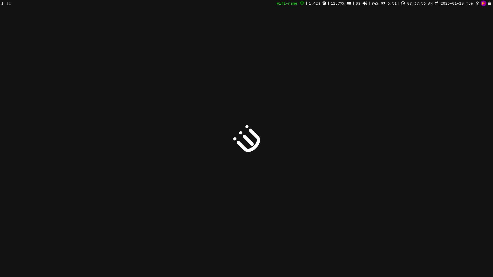
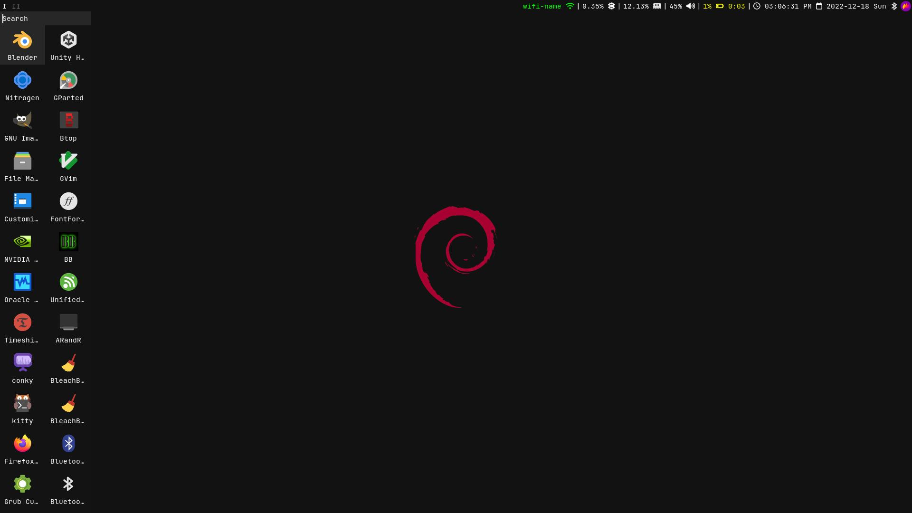
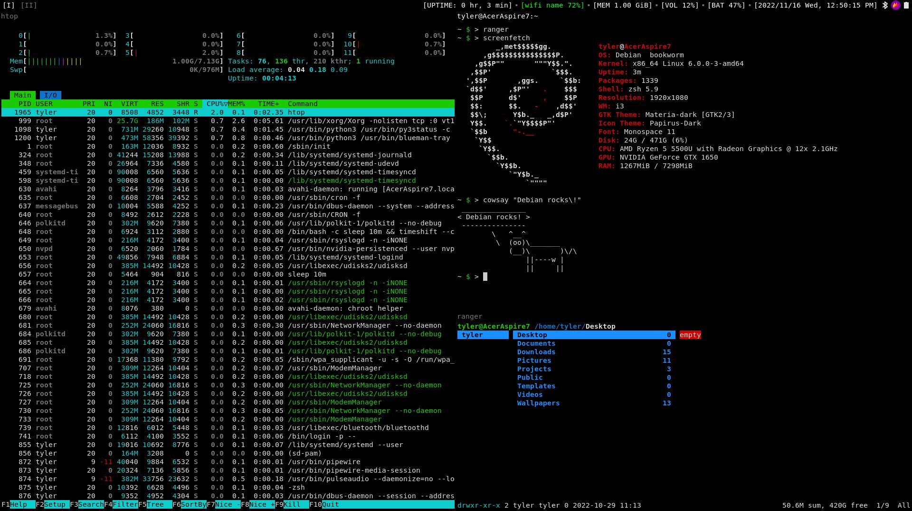

# My i3wm config
This config was designed to work out-of-the-box. All you have to do is follow the installation guide below.







## How to install

### Step 1: install dependencies

Debian:
```
$ sudo apt install sensible-utils xdg-utils brightnessctl pulseaudio pavucontrol py3status nitrogen rofi dunst lxpolkit fonts-dejavu python3-pip playerctl
$ pip install pytz tzlocal
```

Arch:
```
$ sudo pacman -S xdg-utils brightnessctl pulseaudio pavucontrol py3status nitrogen rofi dunst ttf-dejavu python-pip playerctl
$ yay -S sensible-utils lxpolkit  # You can use a different AUR helper, if you choose so.
$ pip install pytz tzlocal
```

### Step 2: clone repository

```
$ mv ~/.config/i3 ~/i3-backup
$ git clone https://github.com/FuriousGamer1356/i3-config ~/.config/i3
```

**The installation is now complete. If you want, you can personalize the config file to fit your needs.**

**Enjoy!**
