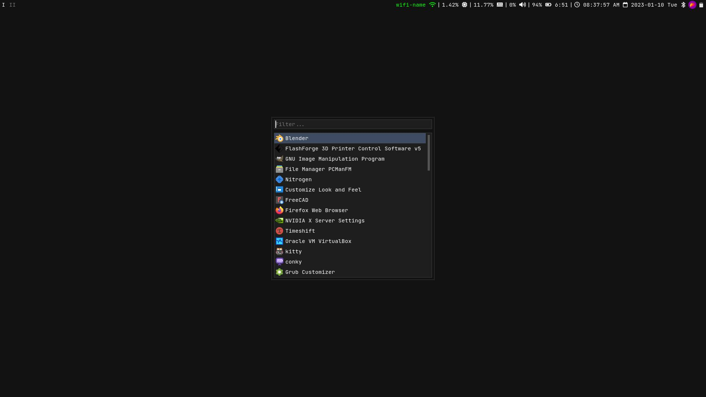

# My i3wm config
This config was designed to work out-of-the-box and be lightweight. All you have to do is follow the installation guide below.





*in case if anyone wants to know, the terminals in the screenshots above are kitty terminals.*

## How to install

### Step 1: install dependencies

**Debian:**
```
$ sudo apt install sensible-utils xdg-utils brightnessctl pulseaudio pavucontrol py3status nitrogen rofi dunst lxpolkit fonts-jetbrains-mono python3-pip playerctl materia-gtk-theme lxappearance
$ pip install pytz tzlocal
```

**Arch:**
```
$ sudo pacman -S xdg-utils brightnessctl pulseaudio pavucontrol py3status nitrogen rofi dunst ttf-jetbrains-mono python-pip playerctl materia-gtk-theme lxappearance
$ yay -S sensible-utils lxpolkit  # You can use a different AUR helper, if you choose so.
$ pip install pytz tzlocal
```

**Install Font Awesome:**
* Download the `fontawesome-free-x.x.x-desktop.zip` archive from [here](https://github.com/FortAwesome/Font-Awesome/releases/latest),
* Run these commands:
```
$ cd ~/Downloads/
$ unzip ~/Downloads/fontawesome-free-*-desktop.zip
$ mv ~/Downloads/fontawesome-free-*-desktop/otfs/* ~/.fonts/
```

### Step 2: clone repository

```
$ mv ~/.config/i3/ ~/i3-backup/
$ git clone https://github.com/FuriousGamer1356/i3-config ~/.config/i3/
```

### Step 3: finishing touches

You're pretty much done! To improve your experience, open `lxappearance` and set the theme to `materia-dark`, and the font to `JetBrains Mono`.

Enjoy! :tada:

## How to remove

If you decide not to use this config anymore and want it off of your system, run these commands.

**Debian:**
```
$ sudo apt remove brightnessctl py3status fonts-jetbrains-mono playerctl materia-gtk-theme lxappearance
$ sudo apt autoremove
$ pip uninstall pytz tzlocal
$ rm -rf ~/.config/i3/ ~/.fonts/Font\ Awesome*
```

**Arch:**
```
$ pip uninstall pytz tzlocal
$ sudo pacman -R py3status nitrogen ttf-jetbrains-mono playerctl materia-gtk-theme lxappearance
$ yay -R sensible-utils lxpolkit  # You can use a different AUR helper, if you choose so.
$ rm -rf ~/.config/i3/ ~/.fonts/Font\ Awesome*
```
