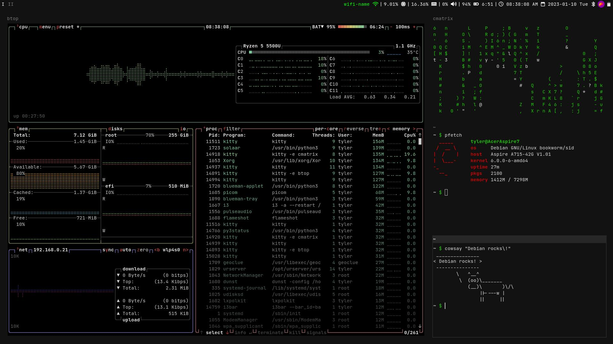

# My i3wm config
This config was designed to work out-of-the-box. All you have to do is follow the installation guide below.




## How to install
Clone repository:
```
mv ~/.config/i3 ~/i3-backup
git clone https://github.com/FuriousGamer1356/i3-config ~/.config/i3
```
Install dependencies:
```
sudo apt install sensible-utils xdg-utils brightnessctl pulseaudio pavucontrol py3status nitrogen rofi dunst lxpolkit
```

The installation is now complete. For the best experience, you can personalize the config file to fit your needs.
